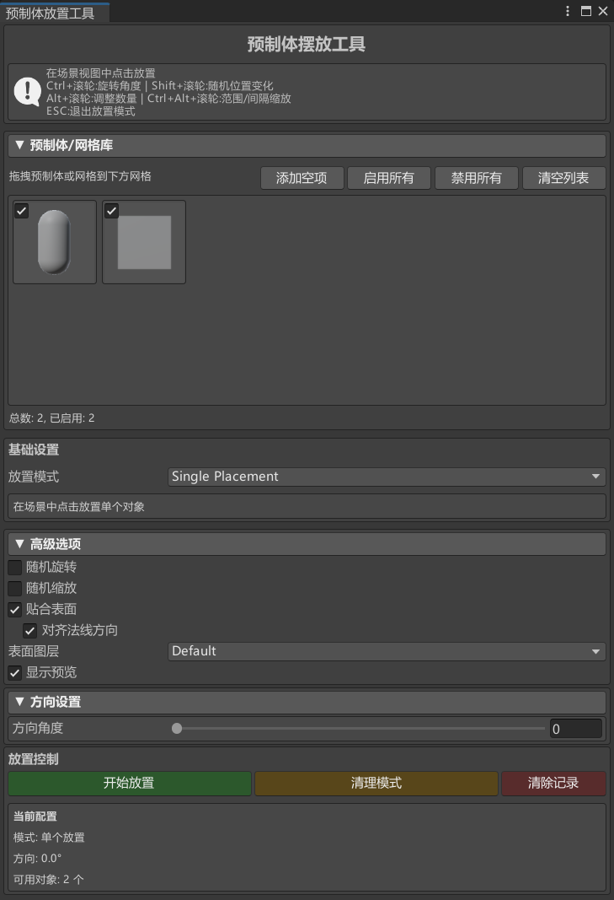

# Unity-PrefabPlacerTool

### **工具介绍**
预制体摆放工具 1.0.0 是一款专为 3D 场景设计的高效布局工具，支持快速放置预制体及网格对象，帮助用户轻松构建丰富多样的场景内容。当前版本提供三种灵活的笔刷模式：

- **单个放置笔刷**：精准定位，逐个放置对象
- **直线放置笔刷**：沿直线路径均匀分布对象
- **范围放置笔刷**：在指定区域内批量布置对象

使用说明：删除笔刷功能目前对网格对象的支持尚不完善，对象查找主要依赖材质信息，建议在使用时注意该限制。

本工具基于 MIT 开源协议发布，用户可根据自身需求自由修改和扩展功能！

演示地址：【Unity 预制体摆放工具】 https://www.bilibili.com/video/BV1x1CABhEfF/?share_source=copy_web&vd_source=4f608f23b534a90172d58411a4c32238

